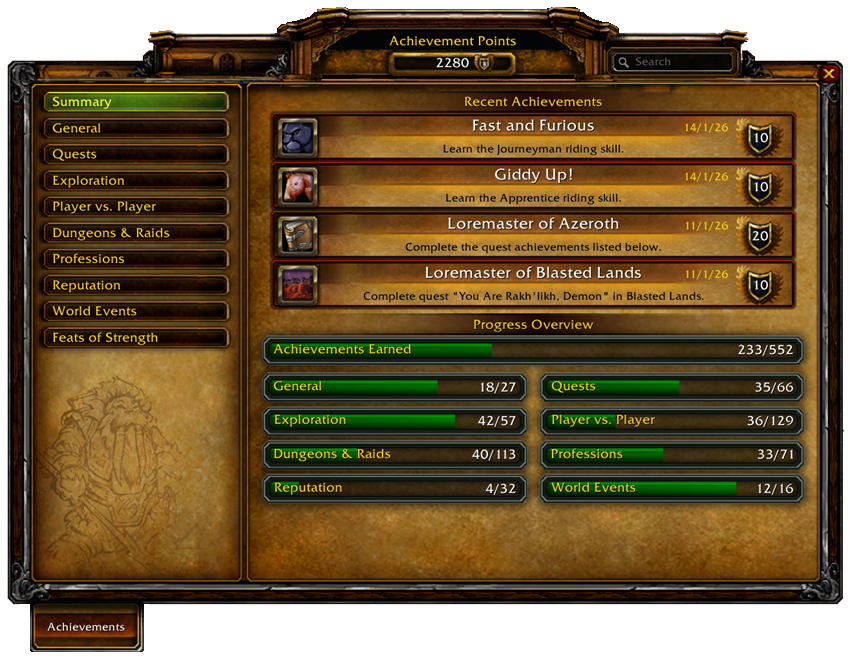

This addon brings you the original Achievement Interface from Blizzard into WoW TBC & Classic

It integrates perfectly with the Standard UI and uses the same graphics and sounds.

### Download

- WoW TBC: Version 2.0.4
- WoW Classic: Version 1.3.2. It works on all Classic Servers (Era, Hardcore, Season of Discovery)

### Achievements

- WoW TBC: 573 achievements (including Feats of Strength) are available in TBC
- WoW Classic: 405 achievements

A full list can be found [here](https://fgaensslen.github.io/AnniversaryAchievements/achievements/index.html).

### Supported Languages

- English
- German

For both languages, almost all achievements use original Blizzard texts and icons.

Using another WoW client language may cause some achievements not to work properly.

### Supported User Interfaces

The addon works best with the Standard UI. If you have modified your interface, you can disable the micromenu button and instead use a button on your minimap.

The addon was tested with the following UIs:

- Standard WoW Interface
- Bartender4
- Dominos
- Dragonflight UI Classic

### Features

- Installing the addon disables the standard quest tracker and replaces it with an object tracker for quests and achievements. Via shift-click, these objects can be removed from the tracker; left-click opens the quest or achievement window. If you don't like this behavior, you can disable it in the addon's options
- Achievements are available for various categories, including PVP, PVE, Reputations, Professions, and more. 
- Key bindings can be configured via the in-game options
- The addon integrates with Deadly Boss Mods (DBM). If you have defeated a certain boss in the past, you will receive the respective achievement upon entering a dungeon and loading DBM automatically. If you don't have DBM, there is an additional check implemented that scans your finished dungeon quests to grant you the achievements
- Achievements for explored areas can be triggered via a scan in the addon's option menu

### Notes

- Due to the huge amount of content, I couldn't test everything. If you find any bugs, wrong localization, or have great ideas for new achievements, please write a comment
- Other addons can prevent you from getting certain achievements: for example Fishing Buddy seems to interfere certain fishing achievements
- Your achievements are NOT stored on Blizzard's servers. To backup them, go into:

    \<your WoW folder\>/WTF/Account/\<account name\>/\<server name\>/\<character name\>/SavedVariables/AnniversaryAchievements.lua

- Guild and Statistics tabs are not available. Comparing achievements with other players who have this addon installed is also not implemented