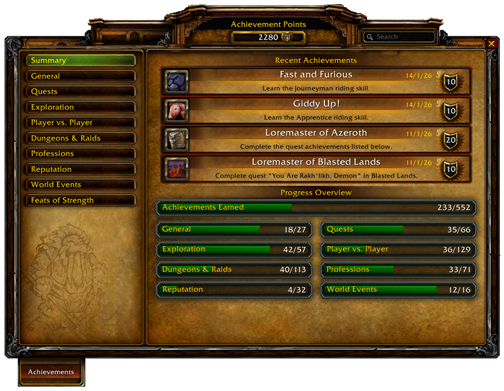

This addon brings you the original Achievement Interface from Blizzard into WoW TBC & Classic

It integrates perfectly with the Standard UI and uses the same graphics and sounds.

### Download

- WoW TBC: Version 2.2.4
- WoW Classic: Version 1.4.6. It works on all Classic Servers (Era, Hardcore, Season of Discovery)

### Achievements

- WoW TBC: 650 achievements (including Feats of Strength)
- WoW Classic: 432 achievements (including Feats of Strength)

A full list can be found [here](https://fgaensslen.github.io/AnniversaryAchievements/achievements/index.html).

### Supported Languages

Classic Era (Interface 11509) loads only `localization/classic/`:

- English (enUS, fallback)
- German (deDE)

TBC Anniversary (Interface 20506) loads only `localization/tbc/`.
Currently enabled there:

- English (enUS)
- German (deDE)
- Spanish (esES)
- Latin American Spanish (esMX)

TBC translation files retained but temporarily disabled pending manual completion:

- French (frFR)
- Korean (koKR)
- Brazilian Portuguese (ptBR)
- Russian (ruRU)
- Simplified Chinese (zhCN)
- Traditional Chinese (zhTW)

The WoW client normally selects `AnniversaryAchievements-Classic.toc` or `AnniversaryAchievements-BCC.toc` before loading Lua files. The unsuffixed `AnniversaryAchievements.toc` is a functional fallback: it lists both enabled locale packages, while hard `ClientFlavor` guards at the beginning of every locale file ensure that Classic Era initializes only `localization/classic/` and TBC Anniversary initializes only `localization/tbc/`. Disabled TBC locale files remain in `localization/tbc/` for manual editing; their matching AreaTable files are retained but disabled as well.

### Supported User Interfaces

The addon works best with the Standard UI. If you have modified your interface, the micromenu button is disabled automatically and instead displays a button at your minimap.

The addon was tested with the following UIs:

- Standard WoW Interface
- Bartender4
- Dominos
- Dragonflight UI Classic

### Features

- Installing the addon disables the standard quest tracker and replaces it with an object tracker for quests and achievements. Via shift-click, these objects can be removed from the tracker; left-click opens the quest or achievement window. If you don't like this behavior, you can disable it in the addon's options
- Achievements are available for various categories, including PVP, PVE, Reputations, Professions, and more. 
- Key bindings can be configured via the in-game options
- WoW classic only: If you have finished a quest in the past that requires you to defeat certain dungeon bosses, the addon will recognize that and grant you the appropriate achievement
- Achievements for explored areas can be triggered via a scan in the addon's option menu

### Notes

- Due to the huge amount of content, I couldn't test everything. If you find any bugs, wrong localization, or have great ideas for new achievements, please write a comment
- The addon doesn’t have access to full historical data like Blizzard’s official achievement system does. The WoW API only provides limited information (for example PvP stats or some quest completions), so it’s unfortunately not always possible to detect things you’ve already done in the past
- You can drag the window to another position by clicking inside the lower part of the summary section
- Guild and Statistics tabs are not available. Comparing achievements with other players who have this addon installed is also not implemented
- Other addons can prevent you from getting certain achievements: for example Fishing Buddy seems to interfere certain fishing achievements
- Your achievements are NOT stored on Blizzard's servers. To backup them, go into:

    \<your WoW folder\>/WTF/Account/\<account name\>/\<server name\>/\<character name\>/SavedVariables/AnniversaryAchievements.lua